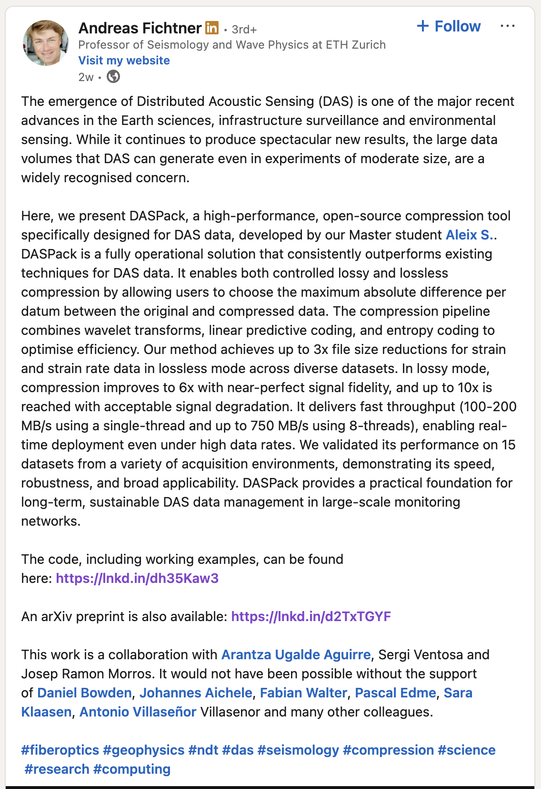

# Marine Cable DAS Data Analysis

## Overview

Distributed Acoustic Sensing (DAS) on marine cables converts fiber optic cables into arrays of thousands of seismic sensors. Data stored in HDF5 format from Ocean Observatories Initiative (OOI).

## HDF5 Format

Hierarchical Data Format 5 - scientific data container supporting:

- Large datasets with compression
- Metadata and attributes
- Multi-dimensional arrays
- Cross-platform compatibility

## Tools

### `daspack/`

Data compression library for DAS datasets. Implements controlled compression algorithms to reduce storage while preserving scientific integrity.

### `OOI_DAS_2024/`

Jupyter notebook for analyzing Ocean Observatories Initiative DAS data from 2024. Includes visualization and processing workflows.

### `scrape_hdf5_files.sh`

Automated scraper for downloading HDF5 files from OOI DAS data server (`piweb.ooirsn.uw.edu/das24/data/`). Maintains directory structure and handles resume/retry.

## Data Source

Ocean Observatories Initiative Regional Cabled Array - distributed acoustic sensing data from submarine cables.

## Context

